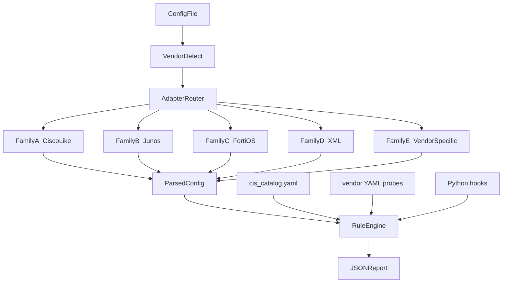

# Network Device Fluff — Unified Phase 1 Plan

Greenfield project in [NETWORK_DEVICE_FLUFF_NEXT](/home/halfluke/Downloads/NETWORK_DEVICE_FLUFF_NEXT) (currently empty). Build **Option A**: Python CLI tool, offline config files, auto vendor detection, CIS L1 per platform with `pass | fail | manual | not_applicable`, JSON output first, TUI in late Phase 1.

**Not in Phase 1:** Batfish reachability, unused-rule/hit-count analysis, live device/API, CIS L2, baseline diff vs gold config.

---

## Phase 1 vendor scope (14 profiles)

| Profile | Required input format | CIS benchmark (L1) | Parser family |
|---------|----------------------|-------------------|---------------|
| `cisco_ios` | `show running-config` | CIS Cisco IOS 17 | **A** — ciscoconfparse2 (`ios`) |
| `cisco_asa` | `show running-config` | CIS Cisco ASA 9.x | **A** — ciscoconfparse2 (`asa`) |
| `cisco_nxos` | `show running-config` | CIS Cisco NX-OS | **A** — ciscoconfparse2 (`nxos`) or hier_config `CISCO_NXOS` |
| `cisco_ftd` | FMC/FDM policy export **or** ASA-shaped run | CIS Cisco Firepower (map to ASA + FTD-specific) | **A + E** — dual adapters (see below) |
| `arista_eos` | `show running-config` | CIS Arista EOS | **A** — ciscoconfparse2 / hier_config `ARISTA_EOS` |
| `hpe_aruba` | `show running-config` | CIS HPE/Aruba (where available; else generic) | **A** — hier_config `HP_PROCURVE` |
| `fortios` | Full `.conf` backup | CIS FortiOS | **C** — hier_config `FORTINET_FORTIOS` |
| `junos` | `show configuration \| display-set` (canonical v1) | CIS Juniper OS | **B** — ciscoconfparse2 brace or hier_config `JUNIPER_JUNOS` |
| `palo_alto` | Exported **XML** config (canonical v1) | CIS Palo Alto Firewall 11 | **D** — stdlib/lxml ElementTree |
| `checkpoint` | SmartCenter/clish text export (document one canonical format) | CIS Check Point | **E** — dedicated line/object parser |
| `sophos_xg` | `.xml` backup export | CIS Sophos (or generic + manual catalog) | **D** — XML adapter (distinct schema from Palo) |
| `sonicwall` | `.exp` / text backup | Generic hardening (limited CIS; manual catalog) | **E** — dedicated text parser |
| `nokia_sros` | SR OS classic CLI config | Nokia / NIST-aligned (manual CIS mapping) | **E** — dedicated block parser |
| `nokia_srl` | JSON config export | Nokia SRL best practices | **E** — JSONPath-style probes |



---

## Parser families and shared code

### Family A — Cisco-like CLI (6 profiles, 1 core adapter)

Shared module: `src/fluff/parsers/cisco_like.py` with `syntax` parameter.

- Profiles: `cisco_ios`, `cisco_asa`, `cisco_nxos`, `arista_eos`, `hpe_aruba`
- Library: **ciscoconfparse2** (not v1); hier_config as optional secondary for diff-style queries later
- Thin wrappers per profile in `parsers/cisco_ios.py`, `cisco_asa.py`, `cisco_nxos.py`, `arista_eos.py`, `hpe_aruba.py` — mostly re-export + profile-specific helpers (e.g. ASA `access-list extended`, NX-OS `feature`)

### Family A + E — Cisco FTD (dual adapter)

`src/fluff/parsers/cisco_ftd.py`:

- **`ftd_asa_text`**: if file contains `ASA Version` / ASA-shaped run → delegate to ASA adapter
- **`ftd_fmc_json`**: if JSON with Firepower policy objects → `parsers/ftd_fmc.py` (normalize to shared `SecurityRule`, `MgmtSettings` structs)

Document both input formats in `docs/input-formats.md`. CIS controls tagged by which export supports automation.

### Family B — Junos

`src/fluff/parsers/junos.py` — normalize `set` lines to searchable text tree; defer curly `{` format to Phase 1 stretch goal.

### Family C — FortiOS

`src/fluff/parsers/fortios.py` — hier_config `Platform.FORTINET_FORTIOS`.

### Family D — XML exports (2 schemas)

- `src/fluff/parsers/palo_alto.py` — PAN XML paths (`/config/devices/entry/deviceconfig/...`)
- `src/fluff/parsers/sophos_xg.py` — separate XPath map; share only `xml_utils.py`

### Family E — Vendor-specific

| Module | Approach |
|--------|----------|
| `checkpoint.py` | Line-oriented state machine: objects, rules, layers; reference nipper-ng `FW1/` logic as spec only (clean-room) |
| `sonicwall.py` | Line blocks + key/value; reference nipper-ng `SonicOS/` as spec |
| `nokia_sros.py` | Indent/block parser for SR OS configure tree |
| `nokia_srl.py` | JSON load + jsonpath probes |

---

## Core architecture

```
network_device_fluff/
├── pyproject.toml
├── docs/input-formats.md
├── src/fluff/
│   ├── cli.py                    # fluff audit -i FILE [-v VENDOR] [--dir DIR]
│   ├── detect/fingerprints.py    # score-based; 14 profiles
│   ├── parsers/                  # adapters above + base.py (ParsedConfig protocol)
│   ├── engine/
│   │   ├── runner.py             # load catalog + vendor YAML + hooks
│   │   ├── probe.py              # forbidden_regex | required_regex | hook
│   │   └── models.py             # Finding, Status, CISRef, Severity
│   ├── checks/
│   │   ├── generic.yaml          # MGMT-001, AAA-001, LOG-001, ...
│   │   ├── cis_catalog.yaml      # all L1 controls + automation: manual
│   │   └── vendors/              # one YAML per profile (14 files)
│   ├── hooks/
│   │   ├── policy_any_any.py     # per-family implementations
│   │   └── mgmt_acl.py
│   └── report/json_report.py
└── tests/fixtures/{profile}/     # good.conf + 2-3 bad variants each
```

### Unified finding schema

Every result includes: `generic_id`, `vendor`, `status`, `severity`, `cis[]`, `evidence[]`, `remediation`, `title`.

Runner logic:

1. Run automated probes from `checks/vendors/{profile}.yaml`
2. Merge with `cis_catalog.yaml` — any L1 control without automated probe → emit `status: manual`
3. Compute summary: `% automated pass`, `fail count`, `manual count`

### Generic check IDs (shared across all 14 profiles)

~15 stable IDs: `MGMT-001` (no telnet), `MGMT-002` (no HTTP admin), `MGMT-003` (mgmt source restriction), `AAA-001`, `AAA-002` (banner), `LOG-001`, `TIME-001`, `SNMP-001`, `SNMP-002`, `AUTH-001`, `AUTH-002`, `POLICY-001` (any-any), `POLICY-002` (mgmt filter). Vendor YAML maps probes to these + CIS control IDs.

---

## CIS L1 targets per profile

Aim **~25–35 L1 controls listed per profile**: ~15–20 automated where feasible, remainder explicit `manual`.

| Profile | Primary CIS source | Manual-heavy areas |
|---------|-------------------|-------------------|
| cisco_ios | CIS IOS 17 L1 | Some routing/crypto controls |
| cisco_asa | CIS ASA L1 | Failover, contexts |
| cisco_nxos | CIS NX-OS L1 | Feature licensing |
| cisco_ftd | CIS Firepower / ASA overlap | FMC-only policy, subscriptions, HA |
| arista_eos | CIS EOS L1 | CoPP depth |
| hpe_aruba | CIS where published; else generic | Model-specific |
| fortios | CIS FortiOS L1 | FortiGuard, HA sync |
| junos | CIS Junos L1 | RE filter complexity, routing auth |
| palo_alto | CIS PAN-OS 11 L1 | WildFire, HA, cloud analysis |
| checkpoint | CIS Check Point L1 | SmartConsole-only state |
| sophos_xg | CIS Sophos / generic | Licensing, live protection |
| sonicwall | Generic + manual catalog | Limited CIS automation |
| nokia_sros | Manual catalog + SR OS guide | Most SP controls manual |
| nokia_srl | Manual catalog | JSON operational state |

---

## Implementation waves (all Phase 1, ordered by dependency)

### Wave 0 — Foundation (block everything else)

- Project scaffold, `pyproject.toml`, typer CLI, `ParsedConfig` protocol, `Finding` models
- Vendor detection skeleton with tests for all 14 fingerprint patterns
- `engine/runner.py` + probe types + JSON report
- `cis_catalog.yaml` structure (stubs for all profiles)
- Empty vendor YAML files + 1 synthetic fixture per profile

### Wave 1 — Family A core (highest reuse)

Implement in order: **cisco_ios** (reference, ~20 auto checks) → **cisco_asa** → **cisco_nxos** → **arista_eos** → **hpe_aruba**

Reuse IOS probes via YAML inheritance (`extends: cisco_ios_base.yaml`) where syntax matches.

### Wave 2 — Family C + B

- **fortios** (hier_config)
- **junos** (set format)

### Wave 3 — Family D

- **palo_alto** (XML)
- **sophos_xg** (XML, new schema map)

### Wave 4 — Family E (highest parser effort)

- **checkpoint** (dedicated parser + checks)
- **sonicwall** (dedicated parser + checks)
- **nokia_sros** + **nokia_srl** (two adapters)
- **cisco_ftd** (ASA-text path first, then FMC JSON path)

### Wave 5 — Policy hooks + polish

- `hooks/policy_any_any.py` — implementations for IOS, ASA, Forti, Palo, CP, SonicWall as parsers allow
- `hooks/mgmt_acl.py` — IOS, NX-OS, Junos RE filter, Palo mgmt profiles
- Batch mode: `fluff audit --dir ./configs/`
- Rich TUI summary table (optional late deliverable)
- `docs/input-formats.md` finalized

---

## Dependencies

```toml
# pyproject.toml
ciscoconfparse2
hier_config
pyyaml
typer
rich          # CLI/TUI
# optional: lxml for large XML (Palo/Sophos)
```

Python **3.11+**. License: **MIT or Apache-2.0** recommended (clean-room; do not copy nipper-ng GPL code).

---

## Testing strategy

- **Per profile:** `tests/fixtures/{profile}/good.*`, `bad_telnet.*`, `bad_snmp.*`, `bad_any_any.*` (where applicable)
- **Per YAML rule:** pytest parametrize `assert finding id/status`
- **Detection:** each fixture file maps to expected profile
- **Golden JSON snapshots** for regression on `good.*` fixtures
- Sanitize real configs before committing fixtures

---

## Reference material (spec only, no code copy)

- nipper-ng `0.11.10/{IOS,PIX,FW1,SonicOS}/report-*.c` — check ideas and wording
- [Nautomation-Prime/Cisco-Compliance-Audit](https://github.com/Nautomation-Prime/Cisco-Compliance-Audit) — YAML rule pack pattern
- CIS benchmark PDFs — control IDs and audit text only

---

## Phase 1 completion criteria

- [ ] 14 vendor profiles with documented input format
- [ ] Auto-detect + `--vendor` override
- [ ] ~15–20 automated checks on Family A profiles; ~10–15 on Family E profiles (honest minimum)
- [ ] Full L1 catalog listed per profile with `manual` entries emitted
- [ ] JSON report with CIS grouping and compliance summary
- [ ] Fixture test suite covering all profiles
- [ ] Batch directory audit

**Estimated effort:** 10–14 weeks solo (parallel waves + vibe-coded YAML); Wave 0–1 proves the engine in ~2–3 weeks.
